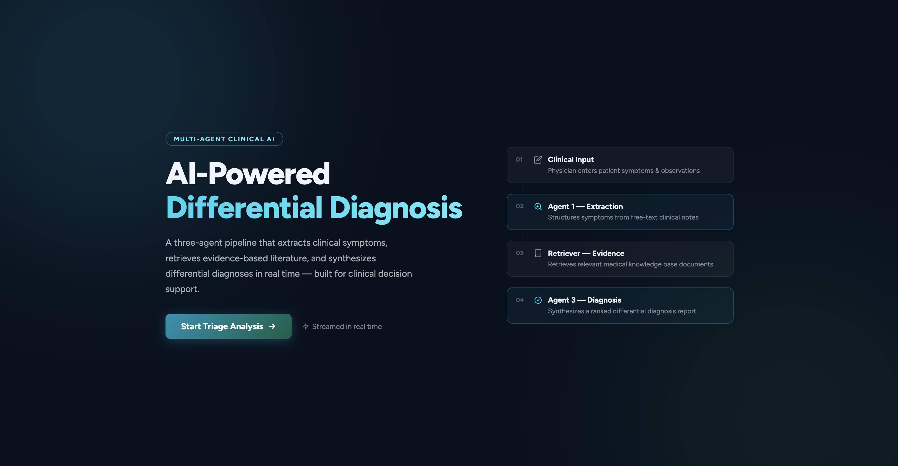
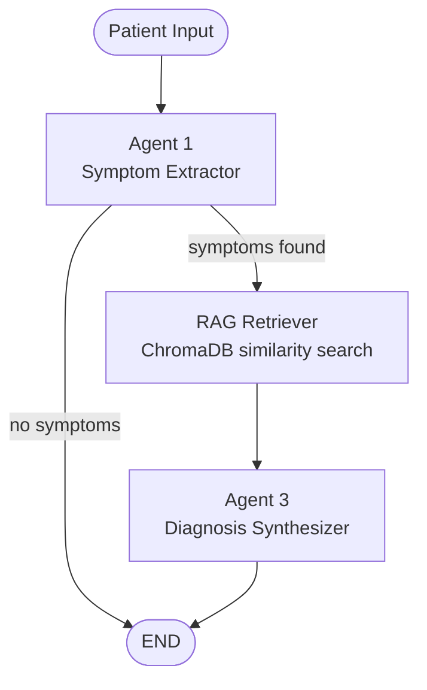

# Medical Multi-Agent System


A **multi-agent LLM system** for medical symptom analysis and structured report generation. Given a patient's free-text description, the system extracts symptoms, retrieves relevant medical literature from a vector database, and synthesizes a comprehensive diagnostic report — all streamed in real time to the browser via SSE.

<p align="center">
  
</p>

---

## Table of Contents

- [Architecture](#architecture)
- [Tech Stack](#tech-stack)
- [Project Structure](#project-structure)
- [Getting Started](#getting-started)
  - [Prerequisites](#prerequisites)
  - [Environment Variables](#environment-variables)
  - [Backend Setup](#backend-setup)
  - [Frontend Setup](#frontend-setup)
  - [Data Ingestion](#data-ingestion)
- [API Reference](#api-reference)
- [Contributing](#contributing)
- [License](#license)

---

## Architecture

The core pipeline is built as a **LangGraph state graph**. Each node is a pure Python function that reads from and writes to a shared `AgentState`.



| Node | Role |
|---|---|
| **Agent 1 — Symptom Extractor** | Parses free-text patient input and returns a structured JSON list of symptoms via a Groq LLM call |
| **RAG Retriever** | Queries ChromaDB with the extracted symptoms using `all-MiniLM-L6-v2` embeddings and returns the top-5 most relevant medical documents |
| **Agent 3 — Diagnosis Synthesizer** | Synthesizes retrieved evidence and symptoms into a structured medical report |

The FastAPI backend exposes a single **Server-Sent Events (SSE)** endpoint that streams each LLM token to the frontend as it is generated.

---

## Tech Stack

| Layer | Technology |
|---|---|
| Agent orchestration | [LangGraph](https://github.com/langchain-ai/langgraph) |
| LLM calls | [LangChain](https://github.com/langchain-ai/langchain) + [Groq](https://groq.com/) |
| Embeddings | [HuggingFace](https://huggingface.co/) — `sentence-transformers/all-MiniLM-L6-v2` |
| Vector database | [ChromaDB](https://www.trychroma.com/) |
| Backend API | [FastAPI](https://fastapi.tiangolo.com/) |
| Frontend server | [Express.js](https://expressjs.com/) |
| Streaming | Server-Sent Events (SSE) |

---

## Project Structure

```
medical-multiagent-team/
├── backend/
│   ├── main.py                  # FastAPI app factory
│   ├── requirements.txt
│   └── src/
│       ├── agents/
│       │   ├── graph.py         # LangGraph pipeline definition
│       │   ├── nodes.py         # Agent node implementations
│       │   └── state.py         # Shared AgentState TypedDict
│       ├── api/
│       │   └── routes.py        # SSE streaming endpoint
│       └── ingestion/
│           └── ingest_db.py     # ETL pipeline → ChromaDB
├── frontend/
│   ├── server.js                # Express static server
│   └── public/                  # HTML/CSS/JS UI
└── data/
    └── processed/               # JSONL medical articles
```

---

## Getting Started

### Prerequisites

- Python 3.11+
- Node.js 18+
- A [Groq API key](https://console.groq.com/)

### Environment Variables

Create a `.env` file inside the `backend/` directory:

```env
GROQ_API=your_groq_api_key
MODEL_NAME=llama3-8b-8192
EMBEDDING_MODEL_NAME=sentence-transformers/all-MiniLM-L6-v2
PERSISTED_CHROMA_DIR=backend/chroma_vector_db
```

### Backend Setup

```bash
cd backend
python -m venv .venv
source .venv/bin/activate       # Windows: .venv\Scripts\activate
pip install -r requirements.txt
uvicorn main:app --reload --port 8000
```

The API will be available at `http://localhost:8000`. Interactive docs at `http://localhost:8000/docs`.

### Frontend Setup

```bash
cd frontend
npm install
node server.js
```

Open `http://localhost:3000` in your browser.

### Data Ingestion

To populate ChromaDB with the medical articles in `backend/data/processed/`:

```bash
cd backend
python -m src.ingestion.ingest_db
```

> **Note:** This step is required only once. The vector database is persisted to disk at the path defined by `PERSISTED_CHROMA_DIR`.

#### Knowledge Base

The medical knowledge base is sourced from the [MedRAG](https://huggingface.co/datasets/MedRAG/statpearls) repository. The current version indexes approximately **2,500 documents** from that corpus. Full credit goes to the MedRAG authors for curating and making this dataset available.

---

## License

This project is licensed under the [MIT License](LICENSE).

> **Disclaimer:** This system is intended for research and educational purposes only. It is **not** a substitute for professional medical advice, diagnosis, or treatment.